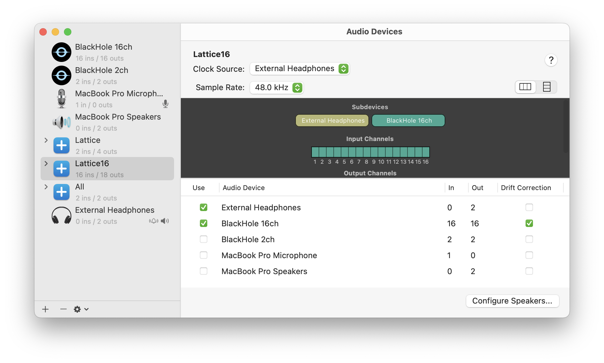
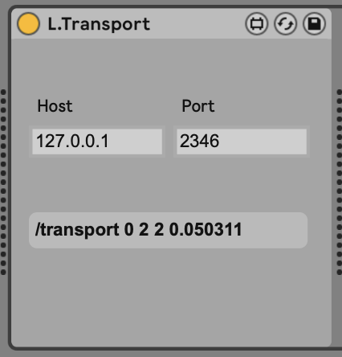

# lattice

A hobbyist project exploring generative art while learning Rust and
[nannou][nannou]. Stuff like this:

<div>
   
   
   
</div>
<div>
   
   
   
</div>
<div>
   
   
   
</div>

You can see more screenshots here on github by looking at the auto generated
[markdown index](index.md) or checkout audio-visual compositions on
[Instagram][insta].

## Overview

Whether you're curious about generative art, interested in audio-visual
performance, or just learning Rust like I am, this project might be worth
exploring. Originally started as a port of my [p5.js project][p5], it's grown
into a surprisingly capable framework that handles the tedious parts of creative
coding - like DAW synchronization, hot-reloading configurations, and
multi-channel audio processing. While I'm still learning Rust best practices,
the project offers some useful features for anyone wanting to experiment with
algorithmic art, especially if you're interested in synchronizing visuals with
music. It's set up to work with MIDI controllers and clock, OSC, audio input,
and even shader programming, making it a fun playground for creative coding
experiments.

## Features

- Export images and capture mp4 videos with the press of a button
- Declarative animation interface with times specified in musical beats, e.g.
  `1.0` represents 1 beat, `0.5` an eight note, `4.0` a bar, and so on.
- Sync animations to BPM and frame count, MIDI clock, MIDI Time Code, or OSC
- Automate parameters with MIDI CC, OSC, CV, or audio with peak, rms, and
  multiband mechanisms all available through a dead simple API
- Sync sketch recording with external MIDI Start message which makes it very
  easy to align your track with the visuals perfectly in post-production
- Write animations in code or configure your sketch to use an external yaml file
  that can be hot-reloaded at runtime (similar to live coding - see
  [Control Scripting](#control-scripting))
- Declarative per-sketch UI control definitions to easily add sliders, selects,
  and checkboxes
- Automatic store/recall of per-sketch UI controls/parameters that can be source
  controlled
- Hot reloadable WGSL shaders with various templates to simplify setup
- Store snapshots of all GUI, MIDI, and OSC controls by pressing `Shift+Number`
  to save and `Cmd+Number` to recall. Snapshots are interpolated to/from at a
  configurable musical length from 1/16th note up to 4bars. Great for live
  performance!
- Runtime switching of sketches
- Ability to override sketch BPM via tap tempo to sync with musicians during
  live performance
- Controls UI adapts to your operating system's theme preference (see
  screenshots below)

### Light Mode


### Dark Mode


## Requirements

This project has been developed on MacOS. I have no idea how it would run on
other platforms. The project requires or optionally needs:

- Rust
- Node/NPM or Bun
- (optional) [just][just] for running commands
- (optional) ffmpeg available on your path for video exports

## Usage

Lattice is still a playground and meant to be cloned and run from source
locally. I eventually might try to make it more of a library.

You will need to run two separate terminal processes: one for the UI controls (A
Typescript/React app rendered in a WebView with Tao and Wry, served with Vite)
and another for the Rust backend.

1. Launch the frontend app server

```sh
cd ./ui
bun start # or npm start
```

In another terminal window, launch the main Lattice app:

```sh
cargo run --release -- <sketch>
# or alternatively
just start <sketch>
```

Where `sketch` is a file in the src/sketches folder (without the extension) and
registered in [src/sketches/mod.rs][module] as well as [src/main.rs][main]. The
sketch parameter is completely optional. All sketches are selectable in the UI
and when run without a default sketch, Lattice will load a template sketch.

Optionally you can pass a `timing` positional argument after the required
`sketch` positional argument to specify what kind of timing system will be used
to run animations on sketches that support it. Available options include:

#### `frame`

Uses Lattice's internal frame system. This is the default and doesn't require
any external devices to run.

#### `osc`

Requires [assets/L.OscTransport.amxd][osc-transport] to be running in Ableton
Live. This provides the most reliable syncing mechanism as Ableton does not
properly send MIDI SPP messages and doesn't support MTC. See the
[OSC](#open-sound-control-osc) section for more details.

#### `midi`

Uses MIDI clock and MIDI Song Position Pointers (SPP) to stay in sync (e.g. when
a MIDI source loops or you jump to somewhere else in a timeline, your animations
will jump or loop accordingly). Bitwig properly sends SPP; Ableton does not.

#### `hybrid`

Uses a combination of MIDI clock (for precision) and MIDI Time Code (MTC) to
stay in sync. This is useful for DAWs that don't support sending SPP but do
support MTC. Ableton, for example, does not support MTC but you can work around
that with https://support.showsync.com/sync-tools/livemtc/introduction

### Creating a new sketch:

1. Copy the [template sketch][template] into a new file in the sketches folder.
2. Rename the `SKETCH_CONFIG.name` field at the top of the file:
   ```rust
   pub const SKETCH_CONFIG: SketchConfig = SketchConfig {
      name: "template", // <-- RENAME THIS!
   ```
3. Add that filename to the [src/sketches/mod.rs][module]
4. Add that sketch module to the `register_sketches` call in
   [src/main.rs][main]:
5. Run that sketch via command line by `cargo run --release <name>` or
   `just start <name>` where `name` is what you put in your file's
   `SKETCH_CONFIG.name` field.

### Audio

#### Single Channel, Multiband Audio (_experimental_)

The Audio struct in Lattice is hardcoded to read audio from the first input
(index 0) on a device named "Lattice" (this can be changed by editing the
`AUDIO_DEVICE_NAME` constant in [src/config.rs][config]). I am currently doing
this via Aggregate Device on my Mac using [Blackhole 2ch][blackhole] to capture
output from my DAW. Here are some screenshots of the setup:

##### Aggregate Device Setup


##### Routing Audio to Blackhole 2ch `Out(3/4):In(1/2)`

> Note that Blackhole automatically routes whatever its output channels are to
> its own input, so sending audio out to Blackhole 3/4 will automatically appear
> on inputs 1/2 in this setup; you don't even need to configure the inputs in
> Ableton at all for this to work (just as long as you have the output config
> set to "Lattice" and enable the appropriate ouputs in the output config under
> Live's audio preferences)


See [audio_dev.rs](src/sketches/dev/audio_dev.rs) for an example sketch.

#### Multichannel Audio

Similar to the above, only treats each audio channel as an individual control
signal with optional slew limiting, suitable for audio-rate or control-rate
signals. Lattice is configured to use an audio device named "Lattice16". On my
computer I'm using the [16 channel version of Blackhole][blackhole].

##### Aggregate Device Setup



> In the above setup I use 1-2 as the main outs and send the multichannel data
> out to channels 2-18 which then appear on Blackhole channels 1-16

See [audio_controls_dev.rs](src/sketches/dev/audio_controls_dev.rs) or
[cv_dev.rs](src/sketches/dev/cv_dev.rs) for an example that uses CV.

### MIDI

MIDI input and output ports are now global settings in the UI

### MIDI Loopback

To automate synth parameters in Ableton and Lattice parameters simultaneously
from _the same UI CC control in Live_ (as opposed to a physical control, in
which case you can skip this section), you need to enable MIDI loopback by
sending MIDI to `Lattice In` and also route `Lattice In` back in to Live to
control parameters. Here's the routing:


To use Ableton automation lanes to control Lattice params, follow these steps:

1. Create a MIDI track and clip and add CC automation to it.
2. In the tracks **MIDI To** router, select `IAC Driver Lattice In` and `Ch. 1`

Those steps are all you need to send MIDI to Lattice to control parameters. As
for controlling a live parameter with that same CC, follow these steps:

1. Play your clip containing the CC data
2. Stop the transport (this is important!)
3. Enter MIDI Mapping mode.
4. Locate the parameter to you want to map and select it (make sure it's the
   last thing you've clicked)
5. Press the Space bar to start the transport. This should do it!

See the [midi_test.rs sketch][midi-sketch] for an example of how to map a
control to something.

> Note: the above instructions are for working without a MIDI controller. When
> working with a MIDI controller you can just map the MIDI control to an Ableton
> device knob that can send CC out to Lattice and also map the controller to an
> Ableton parameter. In this case _you do not_ want Lattice enabled in Ableton's
> MIDI Input ports at all as that just complicates things.

### Sync Recording

With MIDI ports configured in your DAW to send clock to Lattice, Lattice is
already in a place where you can perfectly sync video recordings with audio from
your DAW. Below are steps to setup Ableton Live such that you can record audio
and video simultaneously when you press Play in the DAW (if you only want to
record video you can just do steps 2 and 4):

1. In Ableton > Preferences > Record, make sure **Start Transport With Record**
   is set to **Off**
2. Hit **Q Rec** in Lattice.
3. Arm tracks in Ableton, arm the transport (Record button)
4. Now, pressing play in Ableton will also initiate recording in Lattice,
   likewise pressing Stop in Ableton will stop recording in Lattice.

### Open Sound Control (OSC)

While MIDI is great for controlling parameters in the case that a MIDI
controller can send 14bit high resolution MIDI, it sucks otherwise (128 values
just isn't enough precision for smooth parameter automation). For this reason
Lattice supports OSC and comes with two MaxForLive devices designed to make
integration with Ableton Live simpler.

#### L.OscTransport

[assets/L.OscTransport.amxd][osc-transport]



Place this on any track in Ableton and it will send high precision clock and
exact transport location to Lattice. This should be preferred over using MIDI
Timing however you should still make sure MIDI ports between Ableton and Lattice
are configured properly as Lattice still depends on MIDI clock for starting,
stopping, and syncing video recordings. The default host and port align with
what Lattice expects and can be left alone, though you can configure this in
[src/config.rs][config].

#### L.OscSend

[assets/L.OscSend.amxd][osc-send]


A super basic OSC value sender. While there are much fancier MaxForLive devices
that can send OSC, the "official" OSC Send device that comes with Ableton's
Connection Kit does _not_ send high resolution data, which defeats the entire
purpose!

### Control Scripting

Lattice provides various interfaces for controlling parameters including
`Controls` for UI (sliders, checkboxes, and selects), `MidiControls` and
`OscControls` for controlling parameters from an external source,
`AudioControls` for controlling parameters with audio or CV, and a comprehensive
`Animation` module that can tween or generate random values and ramp to/from
them at musical intervals. While these parameters are simple to setup, it's a
bit of pain to have to restart the rust sketch every time you want to change an
animation or control configuration. For this reason Lattice provides a
`ControlScript` mechanism that uses yaml for configuration and adds these
controls dynamically and self-updates at runtime when the yaml file is changed.
You still have to take care to setup the routings in your sketch (e.g.
`let radius = model.controls.get("radius")`), but once these routings are in
place you are free to edit their ranges, values, timing, etc. See [Control
Script Test][control-script-test] for a working example or
[docs/control_script_reference.md](docs/control_script_reference.md) for
comprehensive documentation.

## Resources

- https://sotrh.github.io/learn-wgpu
- https://inconvergent.net/generative/
- http://www.complexification.net/
- https://n-e-r-v-o-u-s.com/projects/albums/floraform-system/
- https://www.andylomas.com/cellularFormImages.html
- http://www.complexification.net/gallery/machines/sandstroke/
- https://thebookofshaders.com/
- https://github.com/jasonwebb/2d-space-colonization-experiments
- https://paulbourke.net/geometry/
- https://easings.net/

[p5]: https://github.com/Lokua/p5/tree/main
[nannou]: https://github.com/nannou-org/nannou
[insta]: https://www.instagram.com/lokua/
[just]: https://github.com/casey/just
[blackhole]: https://existential.audio/blackhole/
[config]: src/config.rs
[template]: src/sketches/templates/template.rs
[midi-sketch]: src/sketches/midi_test.rs
[module]: src/sketches/mod.rs
[main]: src/main.rs
[control-script-test]: src/sketches/scratch/control_script_test.rs
[osc-transport]: assets/L.OscTransport.amxd
[osc-send]: assets/L.OscSend.amxd
